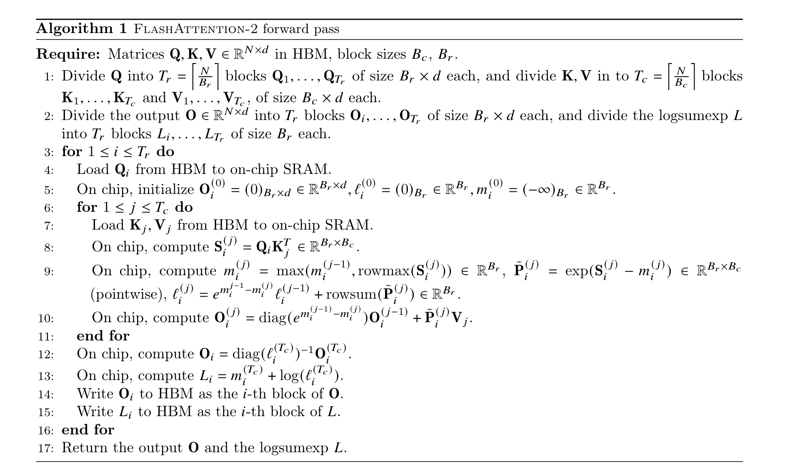

# kernel development


总体开发方式: template + tuning。

template是kernel实现的一个模版，包含一些可变的参数，例如tile size, thread num, pipeline stage等。tuning的作用是在当前硬件以及输入大小下，选择出最优的实现参数。

开发流程如下:

首先根据算法写一个朴素的template实现(确定block间的data访问顺序)，并初始化参数的值，验证正确性。朴素的实现主要包括根据访存与计算、计算与计算的依赖关系，按顺序实现数据在不同层级内存的拷贝，计算。

然后对kernel template进行优化, 借助`ncu` profile的结果，进行对pipeline，data layout等进行优化。

最后将实现的的kernel template分别进行tuning，选择最优性能的kernel。

## template implement

首先在实现template时，需要考虑每个并行block到数据的映射和block内每个warp到数据的映射。对算法进行实现。

### block layout
首先在block间，需要确定数据的tile，以及block访问数据tile的顺序。
访问的顺序会影响硬件的L2 cache hit。
通常代码: 
```cpp
int blockoffset = f(blockIdx.x, blockIdx.y, blockIdx.z);
void* blockptr = ptr + blockoffset;
```

### warp layout

在block内，需要确定线程组到数据的映射。

会影响硬件的 L1 cache到register的data reuse。

不同映射方式会导致shared memory/L1cache IO 不同。


## template optimize&expand

在对朴素的template进行分析和借助`ncu` profile后, 得到template的问题，可以进行pipeline, data layout，loop unroll等方面等优化。并且可以实现多个可能达到最优性能的kernel template。

### pipeline

```python
no pipeline: 
    for i in range(len):
        load q[i], k[i]
        consume(q[i],k[i])

pipeline:
    load q[0], k[0]
    for i in range(len-1):
        load q[i+1], k[i+1]
        consume(q[i],k[i])
    consume(q[len-1],k[len-1])

```
对于profile发现内存和运算利用率均较低、或两个不同运算单元利用均较低的kernel，可以进行pipeline优化。

根据访存与计算, 计算与计算的依赖关系, 设计pipeline。pipeline的目的是消除访存与计算之间的依赖关系造成的等待，提升访存与计算的硬件利用率。

但需要注意的限制因素是 register。 pipeline会造成使用更多的register。

pipeline的实现方式有: 硬件指令, 软件流水线, warp specialize。

### data layout

若profile发现内存访问产生过多wavefront, 可以考虑数据layout的优化。
比如根据不同memory的访存特性, global memory采用 coalesced access, shared memory避免 bank conflict。

对于global memory, 通常的优化方式是保证每个warp每次访问的数据在内存中连续。
对于shared memory, 通常的优化方式是保证每个warp每次访问的数据在shared memory不造成bank conflict，可以使用swizzle或者padding来实现。


### loop unroll

若profile发现branch divergence较大，可以考虑使用loop unroll的方式来减少程序中的条件分支。但代价是可能会使用更多的register。


## tuning

对于kernel的实现参数，不同的参数间对性能的影响是相互耦合的，因此无法事先确定最优参数，需要进行tuning。例如, 更大的tile size和pipeline流水线都会导致更多的register使用, 因此是使用较小的tile size和多级pipeline流水线，还是使用较大的tile size和级数较小pipeline流水线，是一个tradeoff, 需要进行tuning。
另外，对于不同的硬件，由于硬件参数不同，同样需要进行tuning。

tuning 需要的硬件限制因素有: register, shared memory。
tuning space: thread数量与映射，数据tile大小，pipeline 参数等。


# Example: FlashRetnet on A100

## forward

```python
q[batch,head,seqlen_q,dim_qk]
k[batch,head,seqlen_kv,dim_qk]
v[batch,head,seqlen_kv,dim_v]
```


- First implement a kernel template, init params(TILE_M,TILE_N, THREAD_NUM) and verify the correctness of the kernel.

```cpp
// define the block layout, tile size and thread num
grid(seqlen_q/TILE_M, batch*head,1), block(THREAD_NUM, 1, 1)
// consider load, compute, store of the algorithm
kernel(){
    q_block = q + f(blockIdx);
    k_block = k + f(blockIdx);
    v_block = v + f(blockIdx);
    o_block = o + f(blockIdx);

    __shared__ q_shared[TILE_M,dim_qk];
    __shared__ k_shared[TILE_N,dim_qk];
    __shared__ v_shared[TILE_N,dim_v];

    load_global2shared(q_block[:TILE_M,:dim_qk],q_shared);
    for(int i = 0; i<seqlen_kv/TILE_N;i++){
        load_global2shared(k_block[(i:i+1)*TILE_N,:dim_qk],k_shared);

        matmul_shared(q_shared, k_shared,acc_s);

        elementwise_and_reduce(acc_s, acc_o); // elementwise & reduce operation in retnet
        load_global2shared(v[(i:i+1)*TILE_N,dim_v], v_shared);
        matmul_shared_Areg(acc_s, v_shared, acc_o);
    }
    elementwise(acc_o);
    o_thread = o_block + f2(threadIdx);
    store_register2shared(acco, o_thread);
    store_shared2global(o_thread, o_block);
}

matmul_shared(a_shared,b_shared,c_reg){
    c_reg = 0;
    for(int i=0;i<dim_k/warp_k;i++){
        a_thread = a_shared + f2(threadIdx, i);
        b_thread = b_shared + f2(threadIdx, i);
        load_shared2register(a_thread, a_reg);
        load_shared2register(b_thread, b_reg);
        matmul(a_reg, b_reg,c_reg);
    }
}

matmul_block_Areg(a_reg,b_shared,c_reg){
    c_reg = 0;
    for(int i=0;i<dim_k/warp_k;i++){
        b_thread = b_shared + f2(threadIdx, i);
        load_shared2register(b_thread, b_reg);
        matmul(a_reg, b_reg,c_reg);
    }
}
```

- After profiling, we find that both the L2 cache load and tensorcore utilization are low. We can consider using pipeline optimization for loading k and v from global. Also, L1cahce load and tensorcore utilization are low, we can consider using pipeline optimization for loading k and v from shared in matmul_block.
```cpp
kernel(){
    // ...
load_global2shared(k_block[(0:1)*TILE_N,:dim_qk]);
for(int i = 0; i<seqlen_kv/TILE_N;i++){
        load_global2shared(v[(i:i+1)*TILE_N,dim_v]);

        matmul_shared(q_shared, k_shared,acc_s);

        if(i<seqlen_kv/TILE_N-1){
            load_global2shared(k_block[(i+1:i+2)*TILE_N,:dim_qk]);
        }
        elementwise_and_reduce(acc_s, acc_o); // elementwise & reduce operation in retnet
        matmul_shared_Areg(acc_s, v_shared, acc_o);
}
    // ...
}

matmul_shared(a_shared,b_shared,c_reg){
    c_reg = 0;
    a_thread = a_shared + f2(threadIdx, 0);
    b_thread = b_shared + f2(threadIdx, 0);
    load_shared2register(a_thread, a_reg[0]);
    load_shared2register(b_thread, b_reg[0]);
    for(int i=0;i<dim_k/warp_k;i++){
        a_thread = a_shared + f2(threadIdx, i+1);
        b_thread = b_shared + f2(threadIdx, i+1);
        load_shared2register(a_thread, a_reg[i+1]);
        load_shared2register(b_thread, b_reg[i+1]);
        matmul(a_reg[i], b_reg[i],c_reg);
    }
}
```

- Also by ncu profiling, we find that there are shared memory bank conflicts. So we use swizzle to optimize the shared memory layout.
```cpp
// we use swizzle implemented in CuTe
using SmemLayoutAtomQ = decltype(
        composition(Swizzle<kSwizzle, 3, 3>{},
                    Layout<Shape<_8, Int<SmemKAtom>>,
                           Stride<Int<SmemKAtom>, _1>>{}));
    
```

- Considering another pipeline, we can put the accumulator into shared memory to reduce register usage, so that we can use larger tile size. This is a tradeoff between tile size and memory location.
```cpp
kernel(){
    // ...
load_global2shared(k_block[(0:1)*TILE_N,:dim_qk]);
for(int i = 0; i<seqlen_kv/TILE_N;i++){
        load_global2shared(v[(i:i+1)*TILE_N,dim_v]);

        matmul_shared(q_shared, k_shared,acc_s);
        store_register2shared(acc_s, acc_s_shared);

        if(i<seqlen_kv/TILE_N-1){
            load_global2shared(k_block[(i+1:i+2)*TILE_N,:dim_qk]);
        }
        elementwise_and_reduce(acc_s_shared, acc_o); // elementwise & reduce operation in retnet
        matmul_shared(acc_s_shared, v_shared, acc_o);
}
    // ...
}
```

- tuning space: THREAD_NUM, TILE_M, TILE_N, memory location. We can tune to find the best performance.
